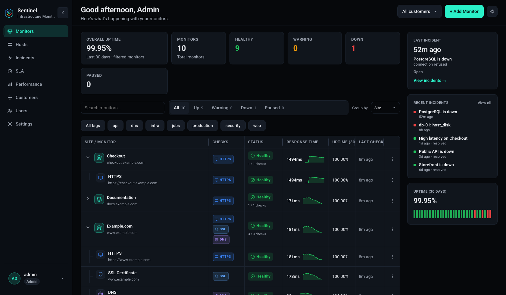
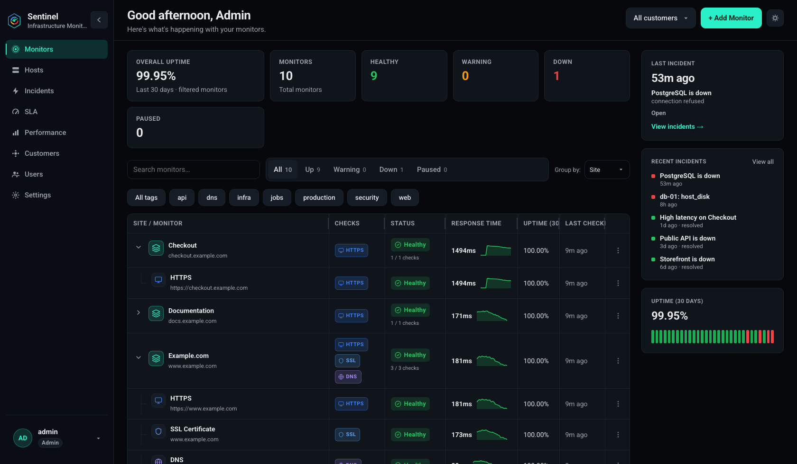
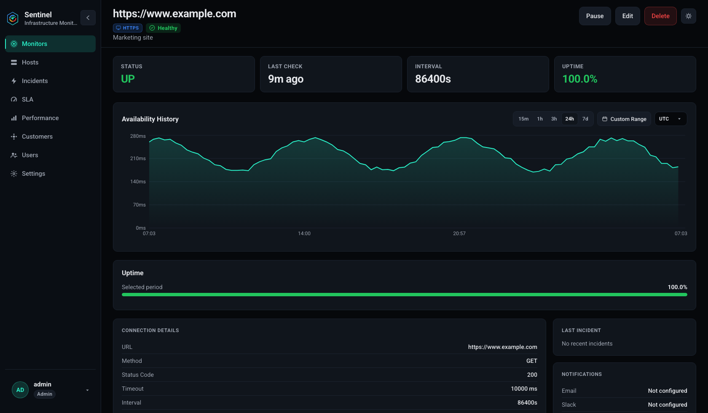
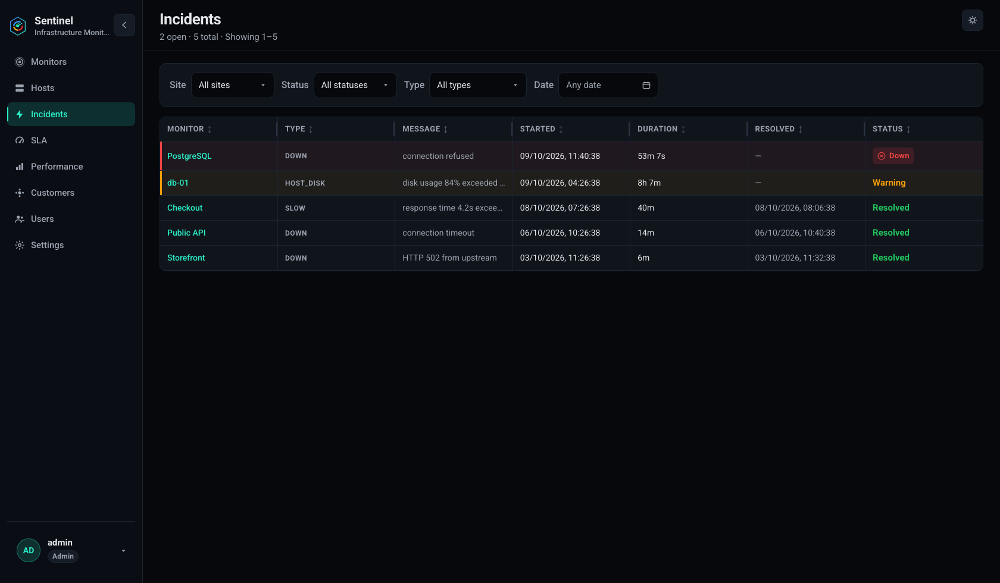
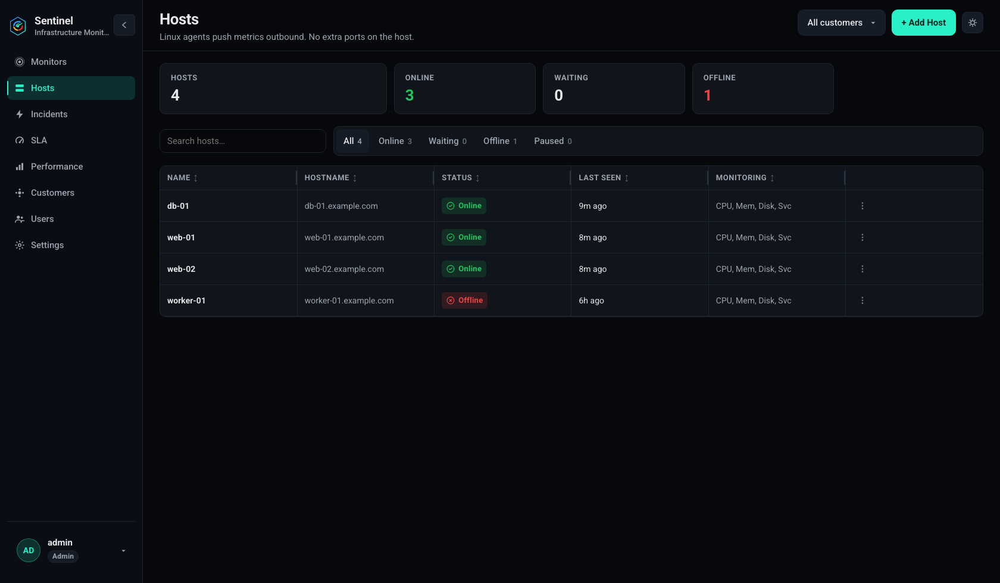
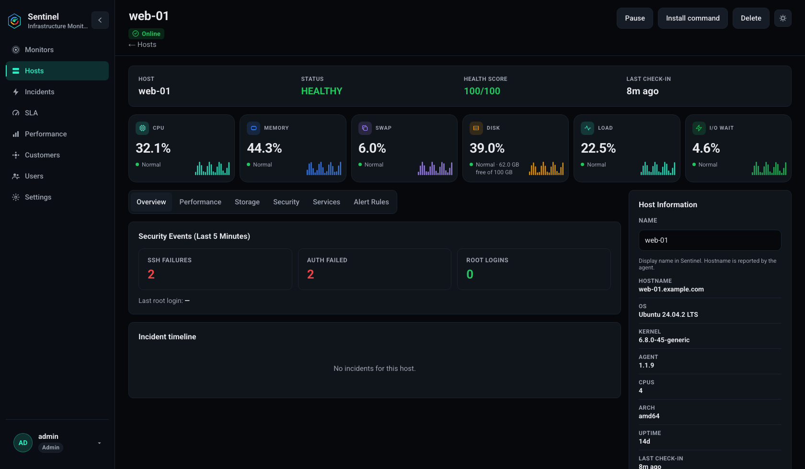
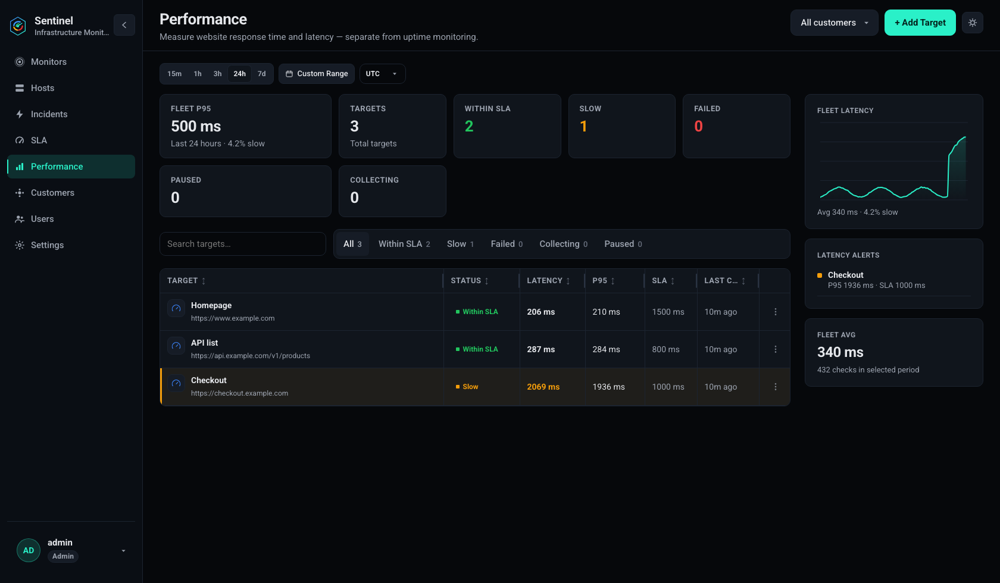
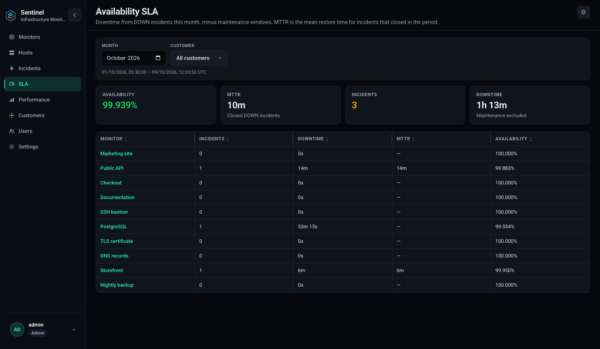
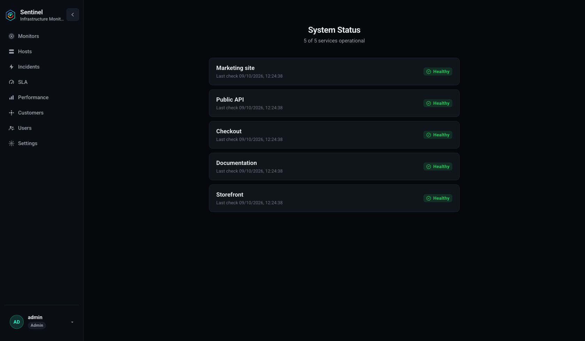

# Sentinel — Self-Hosted Website Monitoring

Sentinel is a lightweight, self-hosted monitoring tool for Linux servers. Monitor websites, ports, SSL certificates, DNS, and host metrics from a single dashboard with SMTP email alerts.

## Features

### HTTP/HTTPS
- GET, POST, HEAD checks with status code and keyword validation
- HTTP Basic Auth (htpasswd) for protected sites
- Response time with DNS, TCP, TLS, and TTFB breakdown
- Slowness detection and SMTP alerts (down, slow, recovery)

### Port Monitoring
- TCP port checks for SSH (22), SMTP (25), DNS (53), HTTP (80), HTTPS (443), MySQL (3306), PostgreSQL (5432), and custom ports
- Alert when a port closes unexpectedly

### SSL Monitoring
- Certificate expiry tracking with alerts at 60, 30, 15, 7, 3, and 1 days
- Detect expired, self-signed, chain errors, wrong hostname, and weak ciphers
- Alert on certificate fingerprint changes

### DNS Monitoring
- Track A, AAAA, MX, TXT, NS, and CNAME records
- Alert when records change (e.g. A record changed from x.x.x.x to y.y.y.y)

### Host Monitoring
- Lightweight Linux agent pushes CPU, memory, swap, disk, load, and I/O metrics outbound (no inbound ports on the host)
- systemd service health and security signals (failed auth, root logins, reboot required)
- Threshold alerts with warning/critical levels and consecutive-breach delay
- Host list and detail views with history charts

### Dashboard
- Monitor list with live status, type badges, and response times
- Create, edit, and **delete** monitors (with confirmation)
- Per-monitor response time graphs (24h / 7d / 30d)
- SMTP settings with test email
- Session-based admin authentication

### Host Monitoring
- Monitor Linux server health and resource usage
- CPU usage and load average monitoring
- Memory and swap usage monitoring
- Disk usage monitoring with configurable thresholds
- Network traffic and interface statistics
- Host uptime and system information
- Alerts when resource usage exceeds configured thresholds
- Track host health alongside website, port, SSL, and DNS monitors

## Screenshots

Sign in, then work from the monitors dashboard. Sample data below uses `example.com` hosts.

<p align="center">
  
</p>

<p align="center">
  
</p>

<p align="center">
  
</p>

<p align="center">
  
</p>

<p align="center">
  
</p>

<p align="center">
  
</p>

<p align="center">
  
</p>

<p align="center">
  
</p>

<p align="center">
  
</p>

## Quick Start (Docker)

```bash
cp config.example.yaml config.yaml
# Edit auth password and SMTP settings
docker compose up -d --build
```

Open http://localhost:8082 — default login: `admin` / `changeme`

## Build from Source

Requirements: Go 1.25.9+, Node.js 20+, GCC (for SQLite)

```bash
make build
./bin/sentinel -config config.example.yaml
```

## Linux Install

```bash
make build
sudo bash scripts/install.sh
```

The installer creates a `sentinel` system user, installs the binary to `/usr/local/bin/sentinel`, config to `/etc/sentinel/config.yaml`, data to `/var/lib/sentinel/`, and a systemd service.

```bash
sudo systemctl status sentinel
sudo journalctl -u sentinel -f
```

## Configuration

See [config.example.yaml](config.example.yaml). Key settings:

| Setting | Description |
|---------|-------------|
| `server.listen` | HTTP listen address (default `0.0.0.0:8082`) |
| `server.workers` | Concurrent probe workers |
| `server.retention_days` | How long to keep check history |
| `auth.username/password` | Dashboard login |
| `smtp.*` | SMTP server for alerts |
| `database.path` | SQLite database path |

SMTP can also be configured from the Settings page in the dashboard.

## API

Full reference with curl examples for every endpoint: [docs/API.md](docs/API.md).

Authenticate with a session cookie after login, or `Authorization: Bearer <token>` from **Settings → API Tokens**.

## Architecture

Single `sentinel` binary runs everything:

1. **Scheduler** — interval-based checks with worker pool
2. **Probers** — HTTP, port, SSL, and DNS checkers
3. **Host agents** — outbound metric push from Linux servers
4. **Alert engine** — SMTP notifications on state changes
5. **REST API + Dashboard** — embedded React UI


## License

MIT — see [LICENSE](LICENSE)
